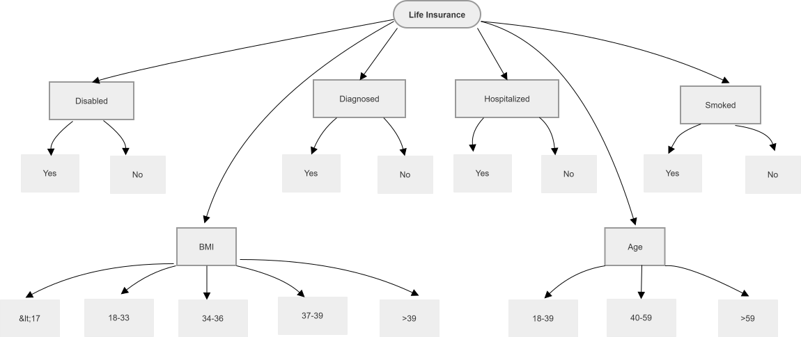

[Back to Main Page](./)

# Classification Tree Technique

> Sources:
> * Certified Tester Advanced Level Test Analyst (CTAL-TA) Syllabus
> * Course ISTQB Advanced Test Analyst from the [Trainer Alexandra Kovalova](https://certifiedunicorns.pro/advancedistqb?utm_source=telegram&utm_medium=webinar-agile-anons&utm_campaign=25-05)

## Applicability

* Creating a classification tree helps identify parameters (classifications) and their equivalence partitions (classes) which are relevant to the object.
* Analyzing the classification tree diagram enables the identification of specific input combinations that are either of particular interest or should be discounted (e.g., incompatible combinations).
* The resulting classification tree can then be used to support Equivalence Partitioning, Boundary Value Analysis, Pairwise Testing or N-wise Testing.

## Applicability Benefits

* Visualizes complex dependencies
* Easily identifies [incompatible combinations](./incompatible_situations.md) 
* Favilitates systematic N-wise coverage

## Data Organization

* **Root Node:** The test object (entity) under the test

* **Classifications (Nodes):** These represent parameters within the data space for the test object, such as input parameters (which can further contain environment states and pre-conditions), and output parameters.
  *Example: If an application can be configured in many different ways, the classifications might include Client, Browser, Language, and Operating System.*

* **Classes (Leaf Nodes):** Each clasification can have any number of classes and sub-classes describing the occurence of the parameter. Each class, or equivalence partition, is a specific value within a classification.
  *Example: The Language classification might include equivalence partitions for English, French and Spanish*    

### Rules and Contraints
* **Rules:**
  * Classes within a classification must be mutually exclusive
  * Classes should collectively cover the entire range of the classification
  * Each class should represent a distinct, test-relevant value

* **Constraints:** Review specification for dependencies between classes: invalid (technically impossible), excluded (out of scope or not supported)
  * *Type 1:* A certain class in Classification A only valid with specific classes in Classification B 
  * *Type 2:* Mutual exclusions between classes across different classifications

### [Classification Tree Visualization](https://app.diagrams.net/#G1LGmr5C4NmzL2OUjF26MR92mzPRWVg0x3#%7B%22pageId%22%3A%22H76gkMXWLeT6auDWMIiv%22%7D)
 
 
 
 

## Mechanics After Visualization: 

### 1. Create the Combination Table:
* Draw horizontal lines below the tree (one per test case)
* Draw vertical lines from each leaf node (class) down through the table
* Label each row (TC1, TC2, TC3, etc.)
  

[Tree Structure Above]

| Test Case                | Smoked | Disabled | Diagnosed | Hospitalized | BMI   | Age   | Expected Result     |
|--------------------------|--------|----------|-----------|--------------|-------|-------|---------------------|
| TC1 (Standard Valid)     | No     | No       | No        | No           | 18-33 | 18-39 | Standard Premium    |
| TC2 (High Risk Age)      | No     | No       | No        | No           | 18-33 | >59   | Increased Premium   |
| TC3 (Underweight Smoker) | Yes    | No       | No        | No           | <17   | 40-59 | High Risk / Reject  |
| TC4 (Invalid Boundary)   | No     | No       | No        | No           | >39   | 18-39 | Decline Application |
...

### 2. Select Coverage Criterion

> For any n-wise coverage, the minimum baseline is always the product of the n largest parameters.

| Coverage Level | Description | Number of Test Cases |
| :-- | :-- | :-- |
| Minimal | Each class appears in at least one test case | Equal to maximum number of classes in any single classification |
| [Pairwise (2-wise)](./supercar-example.md) | Every pair of classes from different classifications appears at least once | Reduced set covering all pairs |
| n-wise | Every combination of n classes from n different classifications appears | Increases with n |
| [Exhaustive](./analytical-example.md) | All possible combinations of all classes | Product of all class counts |

### 3. Mark Test Cases in Combination Table
* For each test case row, place a marker (dot/bullet) at the intersection with exactly one class from each classification
* Each test case must have exactly one class selected per classification

| Component | How to Read |
| :-- | :-- |
| Row | One complete test case |
| Marker position | The selected class for that classification |
| Multiple markers across row | The complete combination of inputs for the test case |

### 4. Apply Constraints to Identify Invalid Test Cases
* Review each test case combination against defined constraints
* Mark test cases that violate constraints as invalid
* Invalid test cases may be:
  * Removed from the test set, OR
  * Flagged separately for negative testing (if applicable)
 
### 5. Derive Concrete Test Cases
* Convert each abstract test case (combination of classes) into concrete test case
* Define:
  * Specific input values representing each selected class
  * Expected results based on specification
  * Preconditions and postconditions

---

## Limitations/Difficalties

* **Scalability:** As the quantity of classifications and/or classes increases, the diagram becomes larger and harder to read/maintain
* **Incomplete Test Cases:** The tree only creates test data combinations. Test Analyst must manually supply the expected results for each combination to create fully executable test cases.
* **Combinatorial explosion:** While using 2-wise (pairwise) combinations decreases the amount of test cases, moving 3-wise or higher drastically increase amounts of test cases count (though this does provide the advantege of higher coverage)

--- 

## Types of Defects
The types of defects found depend entirely on which underlying technique the classification tree is supporting. It will uncover all defects typically found by Equivalence Partitioning, Boundary Value Analysis, or Combinatorial/Pairwise Testing.

---

See also:

* **[Classification Tree Technique: Practice Examples](./classification-tree-examples.md)** - Examples that demostrate the core concept of the Classification Tree Technique.
* **[Classification Tree Tools](./classification-tree-tools.md)** - Links for the most popular tools.
* **[Back to Main Page](./)**

