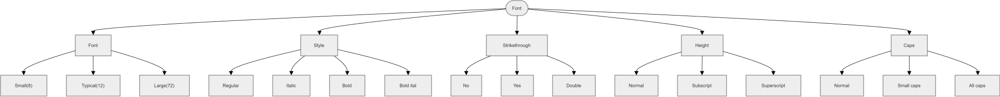

[Back to Main Page](./)

## Advanced Concept: Analytical Coverage

When designing tests, **exhaustive coverage** (testing every single possible combination) is often mathematically impossible due to combinatorial explosion. Furthermore, some input fields have near-infinite possibilities. 

To solve this, making analytical decisions to group classes into **logical partitions** using Equivalence Partitioning and Boundary Value Analysis is the best solution. 

## Analytical Example: Microsoft Word Font Menu

Consider the Font Menu in Microsoft Word a user can select any font size from 1 to 1638. Creating a class (leaf node) for every single size is impossible. Instead, grouping the inputs into logical, testable partitions: **Small (8), Typical (12), and Large (72)**.

Here is the [resulting Classification Tree](https://app.diagrams.net/#G1LGmr5C4NmzL2OUjF26MR92mzPRWVg0x3#%7B%22pageId%22%3A%22zQOh_qRSnj4YGN4gHR6b%22%7D) based on analytical grouping:

## Why this approach matters:
By applying analytical grouping, we reduce the "Font Size" parameter from 1638 possible inputs down to just 3 highly effective test classes. When combined with Pairwise (2-wise) testing across the other classifications (Style, Strikethroug0h, Height, Caps), we can achieve maximum defect detection with a minimal, highly efficient number of test cases.
   
  
--- 

See also:

* **[Classification Tree Examples](./classification-tree-examples)** - Practical Example.
* **[Classification Tree Testing](./classification-tree.md)** - Summary of the core concepts from ISTQB Advanced Test Analyst.
* **[Classification Tree Tools](./classification-tree-tools.md)** - Links for the most popular tools.
* **[Back to Main Page](./)**

