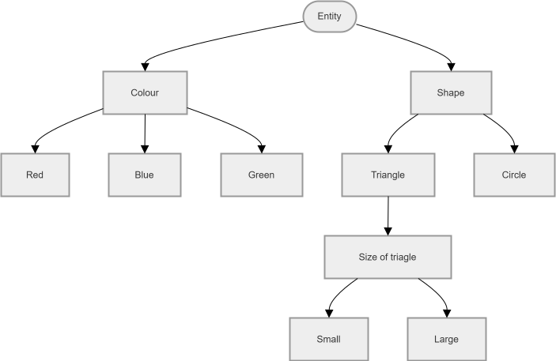

[Back to Main Page](./)

# Complex Dependencies (Nested Classifications)

## The Concept
In the Classification Tree Method, **Hierarchical Dependencies** occur when a parameter (classification) is only relevant based on the selection of a previous class. Instead of creating complex constraints to block invalid combinations, we nest the dependent parameter directly under the relevant class. 

## Scenario: Graphic Object Generator
Imagine we are testing a simple graphic design tool that generates shapes based on user input.

### Requirements:
* **R-01.** Every generated entity must have a defined **Colour** and **Shape**.
* **R-02.** Available colours are Red, Blue, and Green.
* **R-03.** Available shapes are Triangle and Circle.
* **R-04.** If a **Triangle** is selected, the system requires the user to specify a **Size** (Small or Large).
* **R-05.** If a **Circle** is selected, the size is fixed by the system, and the Size parameter is disabled/hidden from the user.

Based on these rules, we nest the "Size" classification directly under the "Triangle" class in the [following Classification Tree](https://app.diagrams.net/#G1LGmr5C4NmzL2OUjF26MR92mzPRWVg0x3#%7B%22pageId%22%3A%22zznoRbdNYCVymFgKQh9d%22%7D):

## Combination Table (Handling Dependencies)

When creating the test cases, notice how the Size columns are handled. If "Circle" is selected, the Size classes are marked with a dash (-) because they are logically impossible and out of scope for that test case.

*(Note: This table demonstrates Minimal Coverage, ensuring every valid leaf node is hit at least once)*

| Test Case | Red | Blue | Green | Triangle | Circle | Small | Large |
| :-- | :-- | :-- | :-- | :-- | :-- | :-- | :-- |
| TC1 | ● |  |  | ● |  | ● |  |
| TC2 |  | ● |  | ● |  |  | ● |
| TC3 |  |  | ● |  | ● | - | - |

### Why this is effective:
If we had put "Size" at the top level next to "Colour" and "Shape", we would have generated test cases like (Green, Circle, Small). We would then have to write extra constraints to invalidate them. By nesting the dependency visually in the tree, we prevent invalid combinations from ever being generated in the first place!

See also:

* **[Classification Tree Examples](./classification-tree-examples)** - Practical Example.
* **[Classification Tree Testing](./classification-tree.md)** - Summary of the core concepts from ISTQB Advanced Test Analyst.
* **[Classification Tree Tools](./classification-tree-tools.md)** - Links for the most popular tools.
* **[Back to Main Page](./)**
