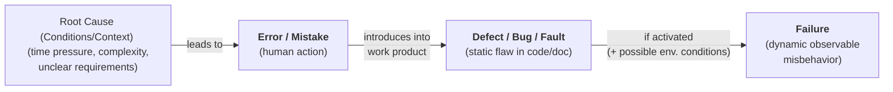

[Back to Main Page](./)

# Defect-Based Test Techniques

> Sources:
> * Certified Tester Advanced Level Test Analyst (CTAL-TA) Syllabus
> * Course ISTQB Advanced Test Analyst from the [Trainer Alexandra Kovalova](https://certifiedunicorns.pro/advancedistqb?utm_source=telegram&utm_medium=webinar-agile-anons&utm_campaign=25-05)

> This technique is based on historical data about the most common bugs for a given domain, programming language, testing level, SDLC stage, or technology.
 
* A defect-based test technique is one in which the type of defect sought is used as the basis for test design, with tests derived systematically from what is known about the type of defect.

The Cause-effect diagram 

* Unlike black-box testing which derives its tests from the test basis, defect-based testing derives tests from lists which focus on defects, known as [defect taxonomies](./defect-taxonomies.md)

* In general, the lists may be organized into defect types, root causes, failure symptoms and other defect-related data. Standard lists apply to multiple types of software and are not product specific. Using these lists helps to leverage industry standard knowledge to derive the particular tests. By adhering to industry-specific lists, metrics regarding defect occurrence can be tracked across projects and even across organizations. 

* The most common defect lists are those which are organization or project specific and make use of specific expertise and experience.

* Defect-based testing may also use lists of identified risks and risk scenarios as a basis for targeting testing. 

* This test technique allows a Test Analyst to target a specific type of defect or to work systematically through a list of known and common defects of a particular type. From this information, the Test Analyst creates the test conditions and test cases that will cause the defect to manifest itself (if it exists).

---

## Applicability 

* Defect-based testing can be applied at any test level but is most commonly applied during system testing.

* In the newest version of the Test Analyst syllabus 4.0, most "defect-based" activities are now part of Software Defect Prevention. Now it is widely used in the shift-left approach.  

---

## Limitations/Difficulties

* Multiple defect taxonomies exist and may be focused on particular types of testing, such as usability.

* It is important to pick a taxonomy that is applicable to the software under test (if any are available). For example, there may not be any taxonomies available for innovative software. 

* Some organizations have compiled their own taxonomies of likely or frequently seen defects. Whatever defect taxonomy is used, it is important to define the expected coverage prior to starting the testing.

---

## Coverage

* The technique provides coverage criteria which are used to determine when all the useful test cases have been identified. Coverage items may be structural elements, specification elements, usage scenarios, or any combination of these, depending on the defect list.

* As a practical matter, the coverage criteria for defect-based test techniques tend to be less systematic than for black-box test techniques in that only general rules for coverage are given and the specific decision about what constitutes the limit of useful coverage is discretionary. As with other techniques, the coverage criteria do not mean that the entire set of tests is complete, but rather that defects being considered no longer suggest any useful tests based on that technique.

* Creating a test for every defect depends on the likelihood and/or impact of the defect

* Sometimes tests might not be necessary at all to cover the defect

* Sometimes several tests might be required to cover defect

---

## Types of Defects

The types of defects discovered usually depend on the defect taxonomy in use. For example, if a user interface defect list is used, the majority of the discovered defects would likely be user interface related, but other defects can be discovered as a by-product of the specific testing.
