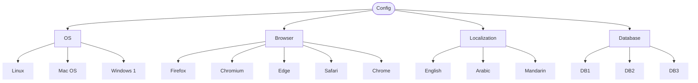

[Back to Main Page](./)

# Incompatible Situations (Environment Constraints)

## The Concept
In combinatorial test design, **Incompatible Situations** occur when certain classes cannot logically or technically coexist. If a test generation tool (or a QA Engineer) blindly combines all inputs, it will generate "impossible" test cases. Attempting to execute these will result in blocked tests or false negatives. 

Identifying and documenting these constraints early saves significant test execution time.

## Scenario: Web Application Compatibility Matrix
We are testing a global enterprise web application. The application must be certified across various combinations of Operating Systems, Browsers, Localizations, and backend Databases.

### Requirements & Constraints:
* **R-01.** The application must be tested across supported OS, Browser, Localization, and Database configurations.
* **R-02 (Constraint).** The **Safari** browser is strictly limited to the **Mac OS** environment.
* **R-03 (Constraint).** The **Edge** browser is strictly limited to the **Windows** environment.
* **R-04 (Constraint).** **DB3** is a legacy database that lacks UTF-8 support; therefore, it is incompatible with **Arabic** and **Mandarin** localizations (English only).

Based on these parameters, we generate the following Classification Tree:

## Combination Table (Handling Constraints)
When designing the test suite, we must actively filter out combinations that violate our constraints. Below is a sample of the test matrix showing both valid combinations and how invalid combinations are flagged.

*(Note: ❌ indicates an invalid test case that should be excluded from the test execution suite)*

| Test Case | OS | Browser | Localization | Database | Status / Traceability |
| :-- | :-- | :-- | :-- | :-- | :-- |
| TC1 | Linux | Firefox | English | DB1 | ✅ Valid |
| TC2 | Mac OS | Safari | Mandarin | DB2 | ✅ Valid |
| TC3 | Windows | Edge | Arabic | DB1 | ✅ Valid |
| TC4 | Windows | Chrome | Mandarin | DB3 | ❌ Invalid (Violates R-04) |
| TC5 | Linux | Safari | English | DB2 | ❌ Invalid (Violates R-02) |
| TC6 | Mac OS | Edge | Arabic | DB1 | ❌ Invalid (Violates R-03) |
| TC7 | Windows | Firefox | English | DB3 | ✅ Valid |

## 💡 Why this is effective:
In a real-world scenario, feeding this tree into an automated combinatorial tool (like ACTS or PICT) without constraints would generate dozens of useless test cases (e.g., trying to boot Safari on Linux). By explicitly defining Incompatible Situations (R-02, R-03, R-04), the Test Analyst ensures the resulting test suite is 100% executable, highly efficient, and free of environmental false-positives.

---

See also:

* **[Classification Tree Examples](./classification-tree-examples)** - Practical Example.
* **[Classification Tree Testing](./classification-tree.md)** - Summary of the core concepts from ISTQB Advanced Test Analyst.
* **[Classification Tree Tools](./classification-tree-tools.md)** - Links for the most popular tools.
* **[Back to Main Page](./)**
