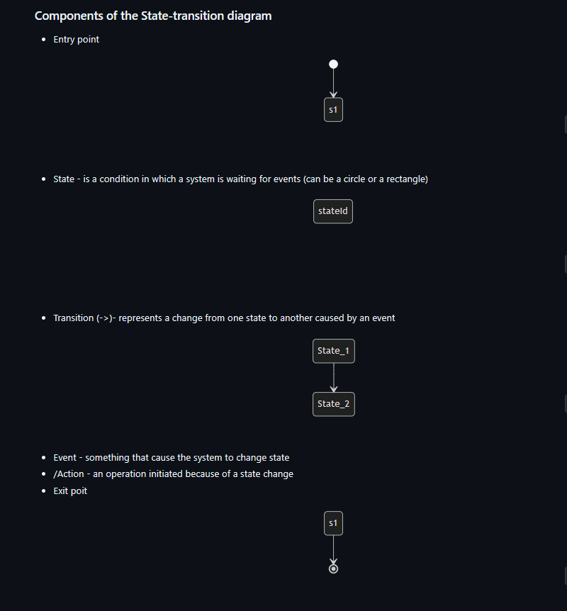
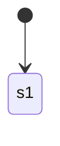
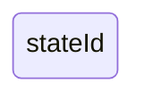
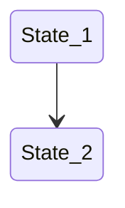
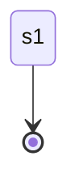

[Back to Main Page](./)

# State Transition Testing

> Sources:
> * Certified Tester Advanced Level Test Analyst (CTAL-TA) Syllabus
> * Course ISTQB Advanced Test Analyst from the [Trainer Alexandra Kovalova](https://certifiedunicorns.pro/advancedistqb?utm_source=telegram&utm_medium=webinar-agile-anons&utm_campaign=25-05)

* State transition testing is used to test the ability of the test object to enter and exit from defined states via valid transitions, as well as to try entering invalid states or covering invalid transitions. 
* Events cause the test object to transition from state to state and to perform actions.
* Events may be qualified by conditions (sometimes called guard conditions or transition guards) which influence the transition path to be taken.

## Technique mechanics

* Can be represented via state-transition diagram or state-transition table
* State-transition diagram shows only valid transitions
* Entry and Exit point are not a State
* Transitions where we have some Event/Action

### Components of the State-transition diagram  

* Entry point

* State - is a condition in which a system is waiting for events (can be a circle or a rectangle)

* Transition (->)- represents a change from one state to another caused by an event

* Event - something that cause the system to change state
* /Action - an operation initiated because of a state change 
* Exit poit 

* Loops 

> *Example:* [Mermaid's syntax for State diagrams](https://mermaid.js.org/syntax/stateDiagram.html#start-and-end) and the most common [State-transitions diagrams in different domains]()

## Structure of the State-transition Table

* State transition table shows both valid (are bold in the table below) and invalid transitions
* To know numbers of valid and invalid transitions can multiply States and Events

### Example 1 State-Transition Table 
>  "Advanced Sowtware Testing - Vol.1" Rex Black

| Current State | Event | Action | Next State |
| -- | -- | -- | -- | 
| **null (or entry point)** | **giveInfo** | **StartPayTimer** | **Made** |
| null | payMoney | -- | null | 
| null | print | -- | null | 
| null | giveTicket | -- | null | 
| null | cancel | -- | null | 
| null | payTimerExpires | -- | null | 
|  |  |  |  | 
| Made | giveInfo | -- | Made |
| **Made** | **payMoney** | -- | **Paid** |
| Made | print | -- | Made |
| Made | giveTicket | -- | Made |
| Made | cancel | -- | Made |
| **Made** | **cancel** | -- | **Can-Cust** |
| **Made** | **payTimerExpires** | -- | **Can-NonPay** |

## Example 2 State-Transition Table 
> Foundations of Software testing ISTQB Certification, 4thEd Graham/Black/van Veenendaal

| | Insert card | Valid PIN | Invalid PIN | 
| -- | -- | -- | -- | 
| S1) Start state | S2 | - | - | 
| S2) Wait for PIN | - | S6 | S3 | 
| S3) 1st try invalid | - | S6 | S4 | 
| S4) 2nd try invalid | - | S6 | S5 | 
| S5) 3nd try invalid | - | - | S7 | 
| S6) Access account | - | ? | ? | 
| S7) Eat card | S1(for new card) | - | - | 

---

## Applicability

* State transition testing is applicable for any software that has defined states and has events that will cause the transitions between those states (e.g., changing screens). 
* State transition testing can be used at any test level.
* Embedded software, web software, and any type of transactional software are good candidates for this type of testing. Control systems, e.g., traffic light controllers, are also good candidates for this type of testing.

---

## Limitations/Difficulties

* Determining the states is often the most difficult part of defining the state transition diagram or state transition table:
  * When the test object has a user interface, the various screens that are displayed for the user are often represented by states.
  * For embedded software, the states may be dependent upon the states of the hardware.
  * Besides the states themselves, the basic unit of state transition testing is the individual transition.

* Simply testing all single transitions will find some kinds of state transition defects, but more may be found by testing sequences of transitions:
  * A single transition is called a 0-switch
  * A sequence of two successive transitions is called a 1-switch;
  * A sequence of three successive transitions is called a 2-switch, and so forth.
  * In general, an N-switch represents N+1 successive transitions

* With N increasing, the number of N-switches grows very quickly, making it difficult to achieve N-switch coverage with a reasonable, small number of tests.

---

## Coverage

* **State coverage:** The minimum acceptable degree of coverage is to have visited every state and traversed every transition at least once.
  
* **Transition coverage:** 100% transition coverage (also known as 100% 0-switch coverage) will guarantee that every state is visited and every transition is traversed, unless the system design or the state transition model (diagram or table) is defective.

       
* **"Round-trip coverage":** applies to situations in which sequences of transitions form loops.
    * 100% round trip coverage is achieved when all loops from any state back to the same state have been tested for all states at which loops begin and end.
    * This loop cannot contain more than one occurrence of any particular state (except the initial/final one).
 
* **Every row (in State-Transition Table):** For any of these approaches, an even higher degree of coverage will attempt to include all invalid transitions identified in a state transition table. 

* **"N-switch coverage":** relates to the number of switches covered of length N+1, as a percentage of the total number of switches of that length.
  * achieving 100% 1-switch coverage requires that every valid sequence of two successive transitions has been tested at least once.
  * This testing may trigger some types of failures that 100% 0-switch coverage would miss.

  
---

## Types of Defects

* Incorrect event types or values
* Incorrect action types or values
* Incorrect initial state
* Inability to reach some exit state(s)
* Inability to enter required states
* Extra (unnecessary) states
* Inability to execute some valid transition(s) correctly
* Ability to execute invalid transitions
* Wrongguard conditions
* During the creation of the state transition model, defects may be found in the specification document.
* The most common types of defects are omissions (i.e., there is no information regarding what should actually happen in a certain situation) and contradictions.

---

See also:

* **[Back to Main Page](./)**
