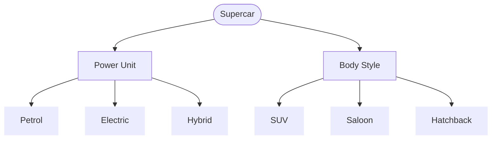

[Back to Main Page](./)

# Supercar Classification Tree (2-wise)

## Requirements:
* **R-01.** Supercar is an online vehicle sales website specializing in a single manufacturer's Sports Utility Vehicles (SUVs) and saloons
* **R-02.** A vehicle has two key elements, power unit and body style.
* **R-03.** The manufacturer offers three choices of power unit: petrol, electric and hybrid.
* **R-04.** There are 3 main body styles: Saloon, Hatchback and SUV.
* **R-05.** SUVs are available only as petrol and electric options.
* **R-06.** Hybrid is available for Hatchback only.
* **R-07.** The website will allow an order to be processed if the chosen vehicle configurations is in stock, otherwise, a message will be displayed to the user to try again later.

Based on the specification, the following classification tree has been developed: 

## Combination Table
*(Note: ❌ indicates an invalid combination based on constraints)*

| Test Case           | Petrol | Electric | Hybrid | SUV  | Saloon | Hatchback |
| :-------------      |  :--:  |   :--:   |  :--:  | :--: |  :--:  |    :--:   |
| TC1                 |    ●   |          |        |   ●  |        |           |
| TC2                 |    ●   |          |        |      |    ●   |           |
| TC3                 |    ●   |          |        |      |        |      ●    |
| TC4                 |        |     ●    |        |   ●  |        |           |
| TC5                 |        |     ●    |        |      |    ●   |           |
| TC6                 |        |     ●    |        |      |        |      ●    |
| ❌ TC7 (R-05, R-06) |        |          |    ●   |  ●   |        |           |
| ❌ TC8 (R-06)       |        |          |    ●   |      |    ●   |           |
| TC9                 |        |          |     ●  |      |        |      ●    |

See also:

* **[Classification Tree Examples](./classification-tree-examples)** - Practical Example.
* **[Classification Tree Testing](./classification-tree.md)** - Summary of the core concepts from ISTQB Advanced Test Analyst.
* **[Classification Tree Tools](./classification-tree-tools.md)** - Links for the most popular tools.
* **[Back to Main Page](./)**
